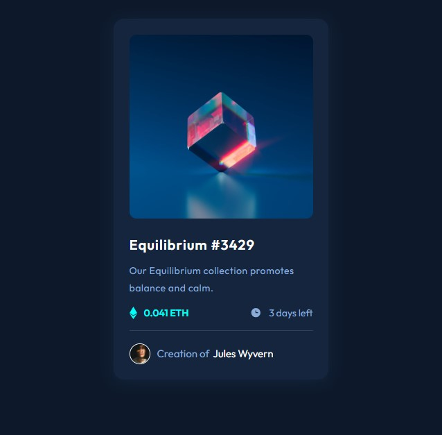
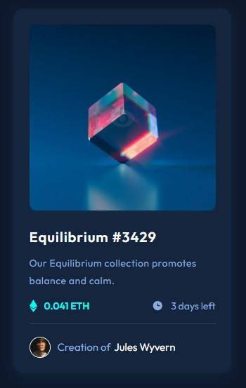

# Frontend Mentor - NFT Preview Card Component app solution

This is a solution to the [NFT preview card component challenge on Frontend Mentor](https://www.frontendmentor.io/challenges/nft-preview-card-component-SbdUL_w0U/hub/nft-preview-card-component-dU9XV82X54). Frontend Mentor challenges help you improve your coding skills by building realistic projects.

## Table of contents

- [Overview](#overview)
  - [The challenge](#the-challenge)
  - [Screenshot](#screenshot)
  - [Built with](#built-with)
- [Author](#author)

## Overview

### The challenge

Users should be able to:

- See hover and focus states for interactive elements
- Added Smooth Box Shadow

### Links

- Solution URL: [GitHub](https://github.com/adamprimera/nft-preview-card-fem)
- Netlify URL: [Netlify](https://adamprimera-frontendmentor-2.netlify.app/)

### Built with

- HTML5
- SASS

## Author

- Frontend Mentor - [link](https://www.frontendmentor.io/profile/adamprimera)

### Screenshot

